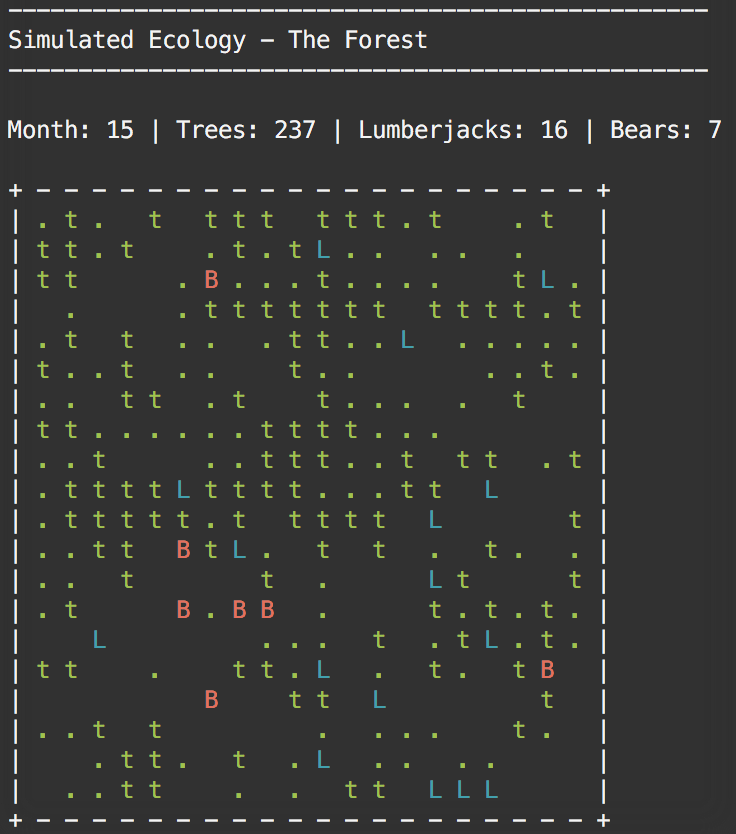

# Simulated Ecology - The Forest

A Python script that simulates a small forest inhabited by lumberjacks and bears. Written for the [165th /r/DailyProgrammer challenge](https://www.reddit.com/r/dailyprogrammer/comments/27h53e/662014_challenge_165_hard_simulated_ecology_the/).

